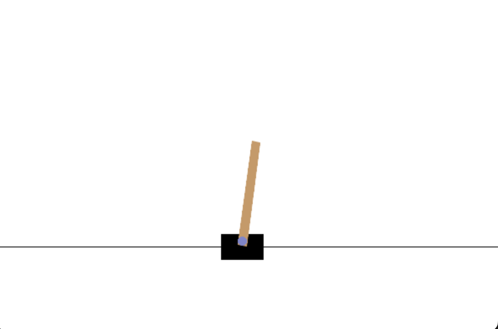
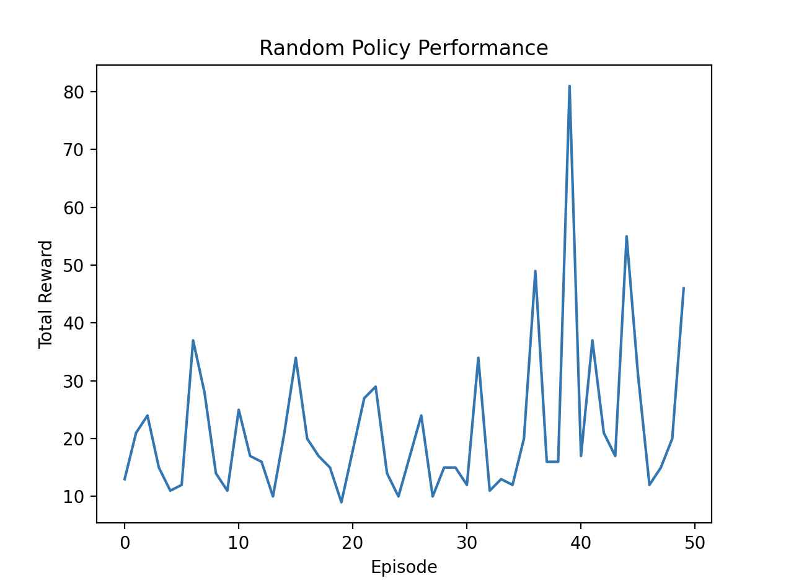

## Day 1: Random Agent

Today, we will implement a random agent that interacts with an environment by taking random actions.
This is a simple baseline to understand how agents can interact with environments in reinforcement learning.

In this exercise, we will:
- Set up a Gymnasium environment
- Implement a random agent
- Visualize the agent's performance

### Step 1: Set Up the Environment

First, we need to install the necessary libraries. Make sure you have `gymnasium` and `matplotlib` installed.
This is already specified in the `pyproject.toml` file, and you can install them using `uv` at the root of this project.

```bash
uv sync
```

To confirm the installation, you can run in this directory (i.e., `one_week_rl/day1_random/`):

```bash
uv run python confirm_installation.py
```

You can see a cart pole environment rendered in a window as below:


### Step 2: Implement the Random Agent

We use CartPole environment from OpenAI Gym for this exercise. The random agent will take random actions in this environment.

You can see the implementation in [`run_random.py`](./run_random.py).

### Step 3: Visualize the Agent's Performance

After running the random agent, we can visualize its performance using `matplotlib`.

```bash
uv run python run_random.py
```

Then, you can see the following plot showing the total rewards obtained by the random agent over multiple episodes:




### Summary

In this exercise, we implemented a random agent that interacts with the CartPole environment from OpenAI Gym.
We visualized the agent's performance over multiple episodes.
In the next days, we will build more sophisticated agents that learn from their interactions with the environment.