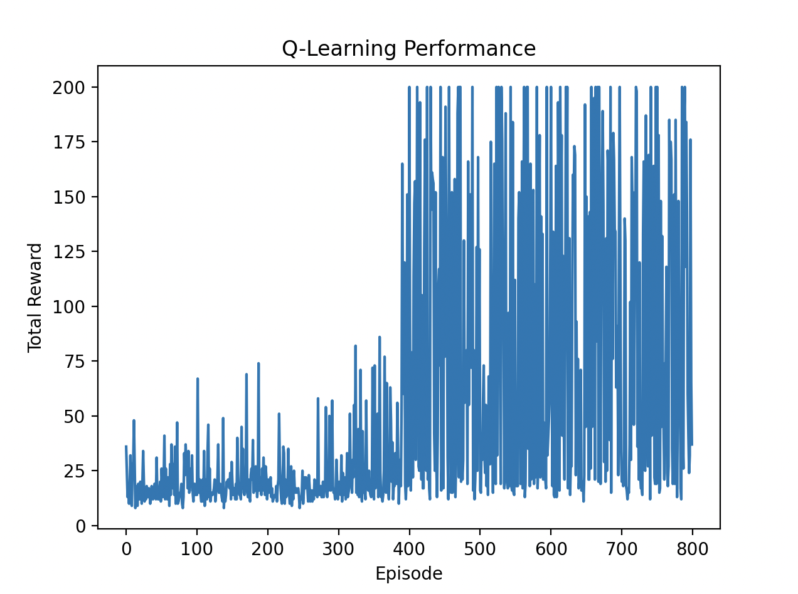

## Day 2: Q-Table

Q-learning is a model-free reinforcement learning algorithm that seeks to learn the value of an action in a particular state.
Today, we will implement a Q-learning agent that uses a Q-table to store and update the values of state-action pairs.

### Q-Learning Algorithm

The fundamental idea behind Q-learning is to learn a policy that maximizes the expected cumulative reward by updating the Q-values based on the agent's experiences. The update rule for Q-learning is given by:

```Q(s, a) ← Q(s, a) + α * (r + γ * max_a' Q(s', a') - Q(s, a))```
where:
- `Q(s, a)` is the current Q-value for state `s` and action `a`
- `α` is the learning rate (0 < α <= 1)
- `r` is the reward received after taking action `a` in state `s`
- `γ` is the discount factor (0 <= γ < 1)
- `s'` is the next state after taking action `a`

```max_a' Q(s', a')``` represents the maximum Q-value for the next state `s'` over all possible actions `a'`.

```r + γ * max_a' Q(s', a') - Q(s, a)``` is known as the temporal difference (TD) error, which measures the difference between the predicted Q-value and the target Q-value.

We can update the Q-value in a pseudo-code as follows:

```python
best_next = np.max(q_table[next_state])  # max_{a'} Q(s', a')
td_target = reward + gamma * best_next    # r + γ * maxQ(s', a')
td_error = td_target - q_table[state][action]  # TD error
q_table[state][action] += alpha * td_error  # Q(s, a) update
```

### Epsilon-Greedy Policy

epsilon-greedy policy is often used to balance exploration and exploitation.
With probability `ε`, the agent explores by selecting a random action, and with probability `1 - ε`, it exploits by selecting the action with the highest Q-value.

### Bucketing States

In environments with continuous state spaces, we can discretize the state space into a finite number of buckets.

For example, in the CartPole environment, we can divide each dimension of the state space into a fixed number of buckets.

```python
state_low = env.observation_space.low
state_high = env.observation_space.high
ratios = (state - state_low) / (state_high - state_low)
new_obs = (ratios * bins).astype(int)
```

### Implementation

We will use the CartPole environment from OpenAI Gym for this exercise.
You can see the implementation in [`run_q_learning.py`](./run_q_learning.py).

### Results

After running the Q-learning agent, we can visualize its performance using `matplotlib`.



### Summary

In this exercise, we implemented a Q-learning agent that uses a Q-table to store and update the values of state-action pairs.
We also discussed the epsilon-greedy policy for action selection and the concept of bucketing states for environments with continuous state spaces.

Next, we will implement a Deep Q-Network (DQN) agent that uses a neural network to approximate the Q-values.
