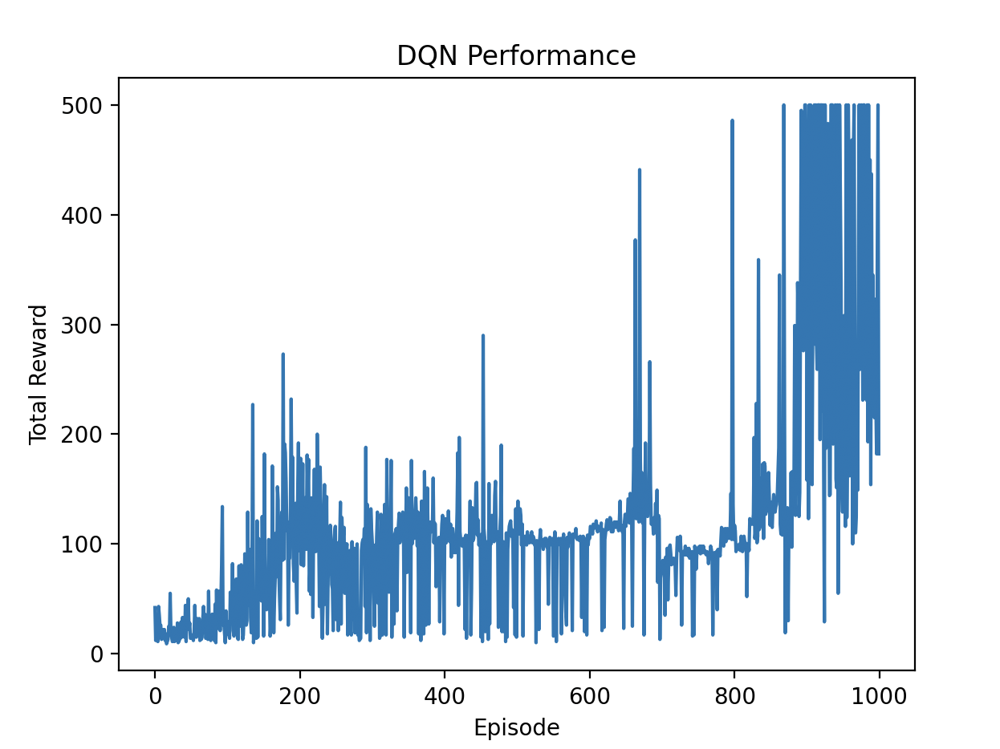

## Day 3: Deep Q-Network (DQN)

In this exercise, we will implement a minimum version of Deep Q-Network (DQN) to solve the CartPole environment.

### Deep Q-Network (DQN)

DQN is an extension of Q-learning that uses a neural network to approximate the Q-values instead of a Q-table.

The neural network takes the state as input and outputs the Q-values for all possible actions.

The loss function for training the DQN is based on the temporal difference (TD) error, similar to Q-learning.

The loss function is given by:

```L(θ) = E[(r + γ * max_{a'} Q(s', a'; θ⁻) - Q(s, a; θ))²]```
where:
- `θ` are the parameters of the current Q-network
- `θ⁻` are the parameters of the target Q-network (a copy of the current Q-network, updated periodically)
- `E` denotes the expectation over the experience replay buffer
- `r`, `γ`, `s`, `a`, `s'` are the same as in Q-learning
The target Q-network helps to stabilize the training by providing a fixed target for a certain number of steps.

The corresponding Python code will be as follows:

```python
# Experience replay sampling
states, actions, rewards, next_states, dones = replay_buffer.sample(batch_size)

# Q-value computation
q_values = q_network(states).gather(1, actions)

# Target computation
with torch.no_grad():
    next_q_values = target_network(next_states).max(1)[0]
    targets = rewards + gamma * next_q_values * (1 - dones)

# Loss
loss = nn.MSELoss()(q_values, targets.detach())
```

### Experience Replay
Experience replay is a technique used to store the agent's experiences in a replay buffer and sample mini-batches of experiences for training the neural network.

This technique:
- Breaks correlation between consecutive samples
- Improves data efficiency by reusing experiences
- Stabilizes training by providing diverse training samples

### Target Network

The target network is a separate neural network used to compute target Q-values in the loss function. Using the current network for target computation can lead to training instability due to rapidly changing target values as the network updates. Instead, the target network parameters are periodically updated to match the current Q-network parameters, providing more stable learning targets.

### Comparison with Q-Learning

Q-learning is a tabular method, while DQN can handle continuous state spaces and is more scalable to larger problems.

Q-learning updates the Q-values directly in a table, while DQN updates the parameters of a neural network.

Q-learning usually uses each experience to update the Q-table on the fly, while DQN uses experience replay to store and sample past experiences, which helps to break the correlation between consecutive samples and improves learning stability.

### Implementation

We will use the CartPole environment from OpenAI Gym for this exercise.
You can see the implementation in [`train_dqn.py`](./train_dqn.py).

```bash
uv run python ./train_dqn.py
```

### Results

After running DQN training, we can visualize the performance using `matplotlib`.
As shown in the reward plot below, DQN typically achieves rewards ranging from 200 to 500.



### Summary

We implemented a minimum version of Deep Q-Network (DQN) to solve the CartPole environment.
We discussed the key components of DQN, including the neural network architecture, experience replay, and target network.
We examined the differences between DQN and traditional Q-learning.

Next, we will enhance our DQN implementation with additional techniques such as Double DQN to further improve performance and stability.