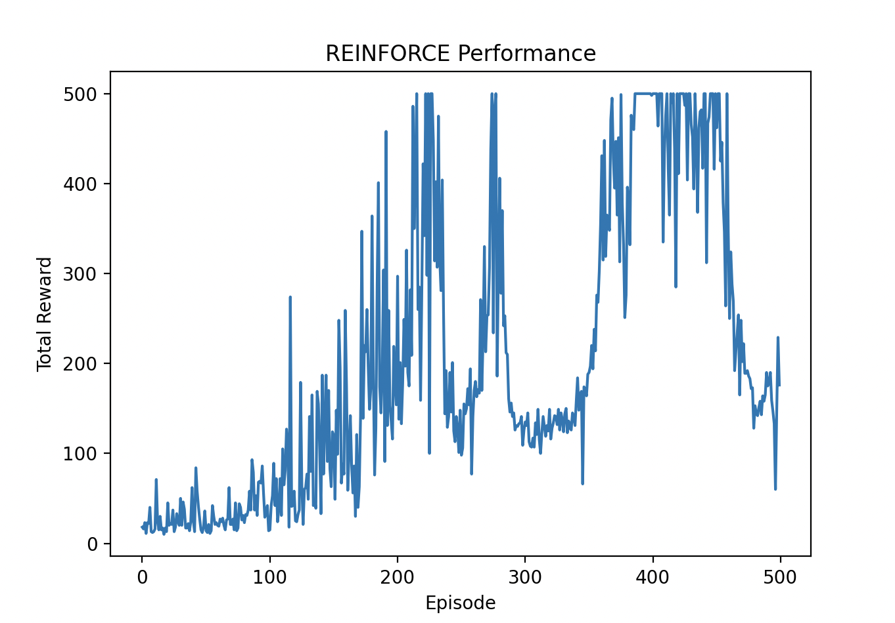

## Day 4: REINFORCE

REINFORCE is a policy gradient method that directly optimizes a policy by maximizing expected cumulative reward.
This method parameterizes the policy using a neural network and updates the network weights based on the gradient of expected reward.

### Policy Gradient Theorem

The policy gradient theorem states that the gradient of expected cumulative reward with respect to policy parameters can be expressed as:

```∇_θ J(θ) = E_π[∇_θ log π(a|s; θ) * Q^π(s, a)]```

where:
- `J(θ)` is the expected cumulative reward
- `π(a|s; θ)` is the policy parameterized by `θ`
- `Q^π(s, a)` is the action-value function under policy `π`
- `E_π` denotes the expectation over the state-action distribution induced by policy `π`

This means we can estimate the gradient of expected reward by sampling actions from the policy and weighting the gradients using the action-value function.

### REINFORCE Algorithm

The REINFORCE algorithm uses Monte Carlo sampling to estimate action-value functions.
The policy parameter update rule is:

```θ ← θ + α * ∇_θ log π(a|s; θ) * G_t```

where:
- `α` is the learning rate (0.001 in our implementation)
- `G_t` is the cumulative reward from time step `t` onwards:
```G_t = r_t + γ * r_{t+1} + γ^2 * r_{t+2} + ...```
- `γ` is the discount factor (0.99 in our implementation)

### Key Implementation Details

- **Return Normalization**: We normalize returns to reduce variance: `(G - mean(G)) / std(G)`
- **Policy Network**: 2-layer neural network with ReLU activation and Softmax output
- **Action Sampling**: Sample actions from the probability distribution output by the policy network

### Implementation

We will use the CartPole environment from OpenAI Gym for this exercise.
You can see the implementation in [`run_reinforce.py`](./run_reinforce.py).

```bash
uv run python run_reinforce.py
```

### Results

After running the REINFORCE agent for 500 episodes, we can visualize its performance using `matplotlib`.
The algorithm typically achieves rewards of 200+ within a few hundred episodes, demonstrating successful learning of the CartPole task.



### Summary

In this exercise, we implemented the REINFORCE algorithm, a policy gradient method for reinforcement learning.
We learned how to parameterize a policy using a neural network and update policy parameters based on the gradient of expected cumulative reward.
This method allows direct policy optimization and can be applied to environments with continuous action spaces.

Next, we will explore more advanced policy gradient methods, such as Actor-Critic.