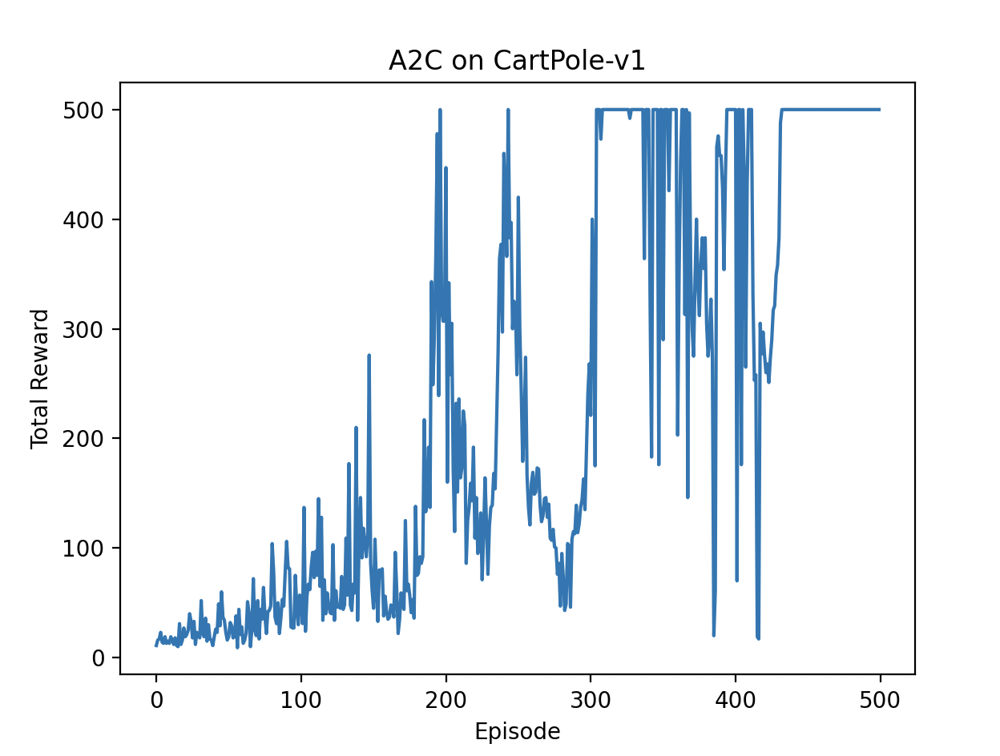

## Day 5: Actor-Critic

In this exercise, we will implement the Actor-Critic (A2C) algorithm, which combines policy-based and value-based methods in reinforcement learning.

### Overview

Actor-Critic methods consist of two main components:
1. **Actor**: This component is responsible for selecting actions based on the current policy. It outputs a probability distribution over actions given the current state.
2. **Critic**: This component evaluates the action taken by the actor by estimating the value function (e.g., state-value or action-value). It provides feedback to the actor to improve the policy.

The Actor-Critic algorithm updates both the policy (actor) and the value function (critic) using the advantage function, which measures how much better an action is compared to the average action at a given state.

### Advantage Function
The advantage function is defined as:

```A(s, a) = Q(s, a) - V(s)```

where:
- `Q(s, a)` is the action-value function
- `V(s)` is the state-value function
The advantage function helps to reduce variance in policy gradient estimates.

### A2C Algorithm
The A2C algorithm updates the actor and critic as follows:
1. **Critic Update**: Minimize MSE loss: `L_critic = MSE(V(s), returns)`
2. **Actor Update**: Policy gradient with advantages: `L_actor = -log π(a|s) * A(s,a)`

### Key Implementation Details
- **Neural Networks**: Both the actor and critic are implemented using neural networks. The actor network outputs a probability distribution over actions, while the critic network outputs a scalar value representing the state-value.
- **Environment**: We will use the CartPole environment from OpenAI Gym for this exercise.

### Implementation
You can see the implementation in [`run_a2c.py`](./run_a2c.py).

```bash
uv run python run_a2c.py
```

### Results
After running the A2C agent for 500 episodes, we can visualize its performance using `matplotlib`. The algorithm typically achieves rewards of 500 (the maximum) within a few hundred episodes, demonstrating successful learning of the CartPole task.



### Summary
In this exercise, we implemented the Actor-Critic (A2C) algorithm, which combines policy-based and value-based methods in reinforcement learning. We learned how to use the advantage function to update both the actor and critic networks, allowing for more stable and efficient learning. This method is widely used in various reinforcement learning applications and can be extended to more complex environments and tasks.

Next, we will explore more advanced policy gradient methods, such as Proximal Policy Optimization (PPO).
