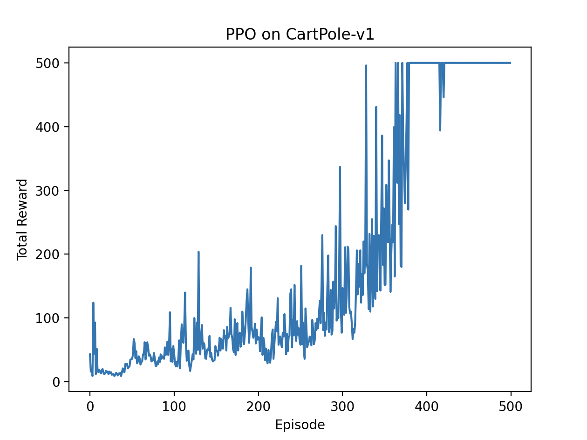

## Day 6: Proximal Policy Optimization (PPO)

In this exercise, we will implement the Proximal Policy Optimization (PPO) algorithm, which is a state-of-the-art policy gradient method in reinforcement learning.

### Overview

PPO is designed to improve the stability and reliability of policy gradient methods by limiting the size of policy updates. It achieves this by using a clipped surrogate objective function that prevents large changes to the policy.

### PPO Algorithm

The PPO algorithm updates the policy using the following objective function:

```L_clip(θ) = E[min(r(θ) * A, clip(r(θ), 1 - ε, 1 + ε) * A)]```

where:
- `r(θ) = π_θ(a|s) / π_θ_old(a|s)` is the probability ratio between the new and old policies.
- `A` is the advantage function.
- `ε` is a hyperparameter that controls the clipping range.

### Key Implementation Details
- **Neural Networks**: Similar to A2C, PPO uses separate neural networks for the policy (actor) and value function (critic).
- **Clipping**: The clipping mechanism is crucial to ensure that the policy does not change too drastically in a single update.

### Implementation
You can see the implementation in [`run_ppo.py`](./run_ppo.py).

```bash
uv run python run_ppo.py
```

### Results
After running the PPO agent for 500 episodes, we can visualize its performance using `matplotlib`. The algorithm typically achieves rewards of 500 (the maximum) within a few hundred episodes, demonstrating successful learning of the CartPole task.



### Summary
In this exercise, we implemented the Proximal Policy Optimization (PPO) algorithm, which improves the stability of policy gradient methods by using a clipped surrogate objective. We learned how to effectively update the policy while preventing large, destabilizing changes. PPO is widely used in various reinforcement learning applications and has been shown to perform well in many complex environments.

Next, we will overview more advanced topics such as practical RL libraries and real-world applications.