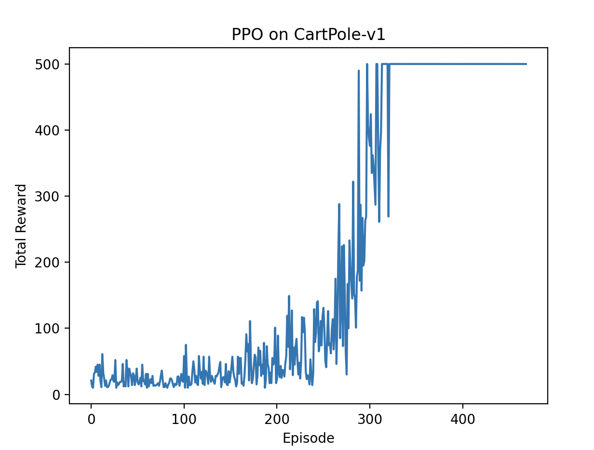
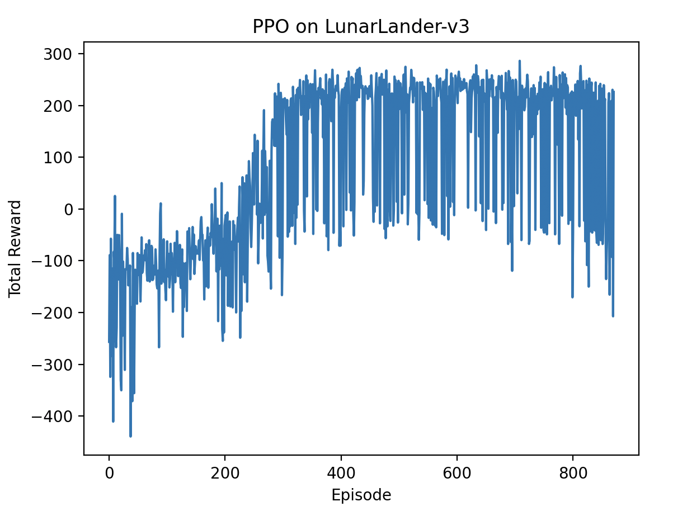

## Day 7: Reinforcement Learning with Libraries

In the final day of **One Week RL**, we move beyond scratch implementations and explore how modern RL libraries like **Stable Baselines 3** can be used to reproduce, extend, and deploy the algorithms we built earlier.

### Overview

Several libraries are widely used in the reinforcement learning community. Some of the most popular ones include:
- **[Stable Baselines3](https://github.com/DLR-RM/stable-baselines3)**: A set of reliable implementations of reinforcement learning algorithms in PyTorch.
- **[RLlib (Ray)](https://docs.ray.io/en/latest/rllib/index.html)**: A scalable reinforcement learning library built on top of Ray, designed for distributed computing.
- **[Tianshou](https://tianshou.org/en/latest/)**: A reinforcement learning library based on PyTorch, focusing on modularity and flexibility.

## Stable Baselines 3 Example

We will demonstrate how to use Stable Baselines 3 to implement the PPO algorithm on the CartPole environment. In the previous day, we implemented PPO from scratch. Now, we will see how to achieve similar results using Stable Baselines 3.

Key steps are as follows:

```python
import gymnasium as gym
from stable_baselines3 import PPO

env = gym.make("CartPole-v1")
model = PPO("MlpPolicy", env, verbose=1)
model.learn(total_timesteps=100_000)
model.save("ppo_cartpole")
env.close()
```

The actual implementation can be found in [`run_sb3_ppo.py`](./run_sb3_ppo.py).

Install Stable Baselines 3 if you haven't already:

```bash
uv sync --extra rllibs
```

Then run the script:

```bash
uv run python run_sb3_ppo.py
```

### CartPole-v1 Results

After training the PPO agent using Stable Baselines 3, we can evaluate its performance similarly to our previous implementations. The agent typically achieves high rewards quickly, demonstrating the effectiveness of the library.



### Changing Tasks

One of the advantages of using libraries like Stable Baselines 3 is the ease of switching between different environments. For example, to change from CartPole to LunarLander, you only need to modify the environment creation line:

```python
# Change environment to LunarLander.
env = gym.make("LunarLander-v3")
...
# Increase training timesteps for a more complex task.
model.learn(total_timesteps=300_000)
...
```
This flexibility allows for rapid experimentation across various tasks without changing the core algorithm implementation.

The full implementation for LunarLander can be found in [`run_sb3_ppo_lunarlander.py`](./run_sb3_ppo_lunarlander.py).

```bash
uv run python run_sb3_ppo_lunarlander.py
```

The results for LunarLander are as follows:


### Summary

In this final exercise, we explored how to leverage modern reinforcement learning libraries like Stable Baselines 3 to implement and deploy RL algorithms efficiently. We saw how easy it is to switch between different environments and tasks, allowing for rapid experimentation and development. Using these libraries can significantly speed up the process of building and testing RL agents, making them invaluable tools for both research and practical applications.

Throughout this week, we have covered a range of fundamental and advanced topics in reinforcement learning, from basic algorithms to widely used, strong baseline methods. We hope this journey has provided you with a solid foundation and the confidence to explore further in the exciting field of reinforcement learning.

Enjoy your continued journey in reinforcement learning!